## 项目简介

password-XL 是一个开源的密码管理项目，旨在为用户提供安全、便捷的密码管理服务。项目不仅功能丰富多样，还具备极高的安全性。代码已在 Gitee 上开源，任何人都可以审查并免费使用，确保项目的透明性和可靠性。

## 项目地址
您可以通过以下链接立即体验 password-XL：

阿里云OSS演示账号：[点我打开](https://password-xl.cn/#/login?type=oss&autoLogin=a72224a46ea5ee07e6589c8a5d56f8f4905d5fbb86ddd07ff088bf6d8c91e992613554ad1772b902fea4644f57d6c127f4a909efe5b155fef63a01c21842dbfaec48584d21acb5d3f6668f5aa911a6068bb2bc24785571b8e8bcb20d956689c185a8daf60298ece9f70a1d1251507da721a386bbdccf936759969de699b8ffd3dec9b8c030f940b79c94c73df0167b22bd74164197447574e1404a15a0c436c72ad4e5a743b431be387da08ca2c0bbf7)
密码：123456

官方服务地址：[https://password-xl.cn]()

界面示例：

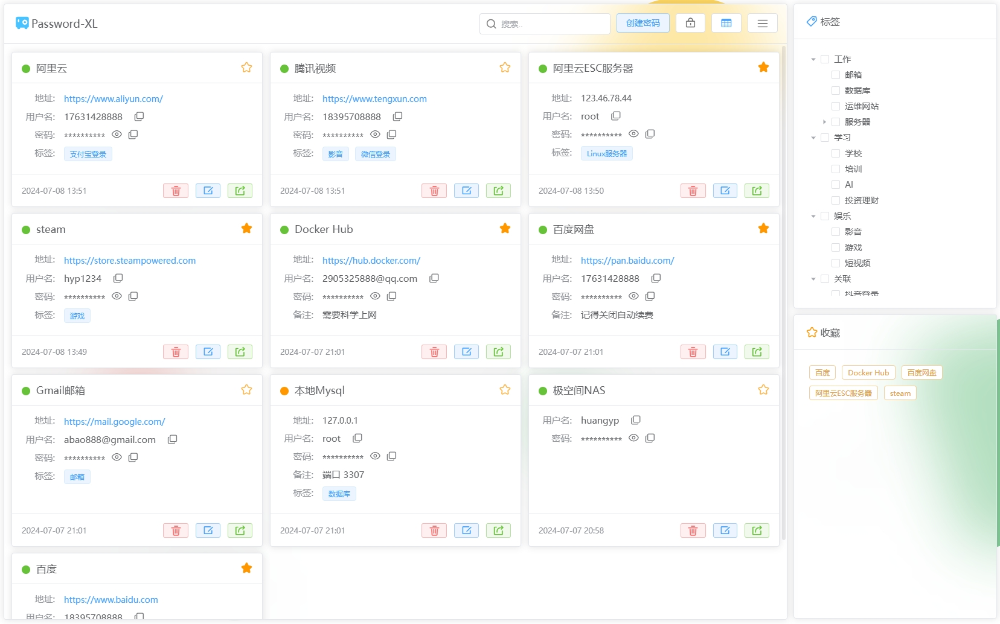

## 功能简介
password-XL 提供了丰富的功能及高度定制化的设计，以满足不同用户的需求：

* **视图：** 您可以根据喜好选择`表格视图`或`卡片视图`

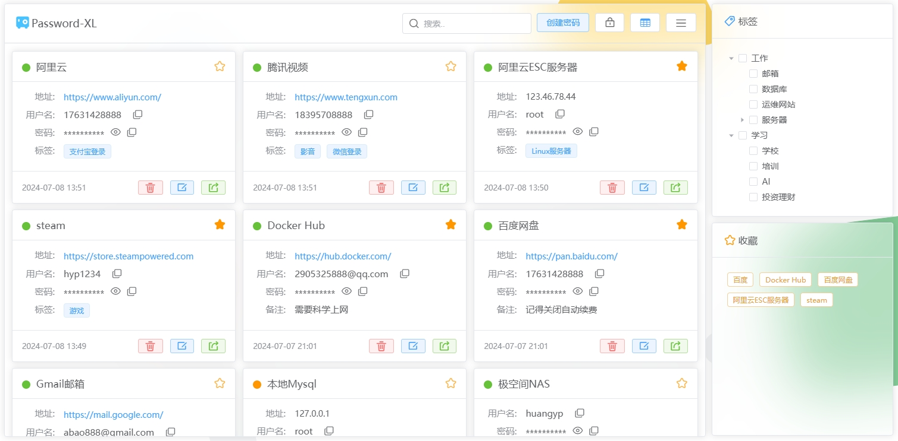

* **主题：** 我们提供**明亮**和**深色**两种主题，您可根据需要进行切换

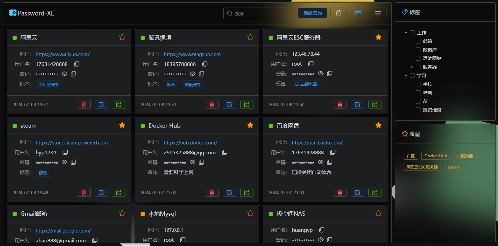

* **密码生成器：** 在创建密码时，您可以通过`密码生成器`快速**生成安全的随机密码**，并根据需要调整密码的组成和长度

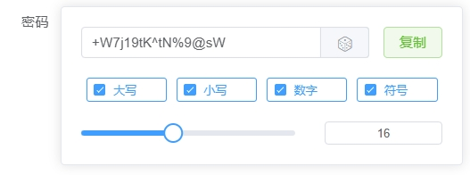

* **快捷键：** 支持常用功能快捷键：锁定/解锁 `Alt + L` 搜索 `Ctrl + F` 创建 `Alt + N` 保存 `Ctrl + S`

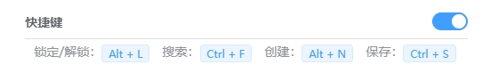

* **搜索：** 您可以使用顶部搜索框根据密码名称、用户名、标签、备注等信息快速搜索密码

* **密码回收站：** 您可以在`密码回收站`中查看已删除的密码，并选择恢复或永久删除。请注意，回收站功能需手动开启

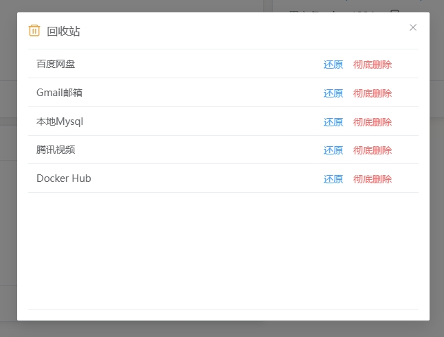

* **密码标签：** 通过密码标签卡片，您可以对密码进行分类和筛选，非常方便的管理和查找您的密码

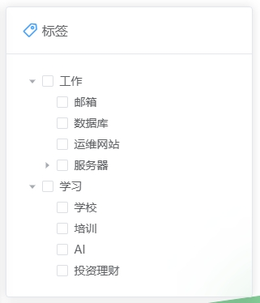

* **收藏密码：** 您可以将常用密码添加到`收藏夹`，以便快速通过收藏卡片访问

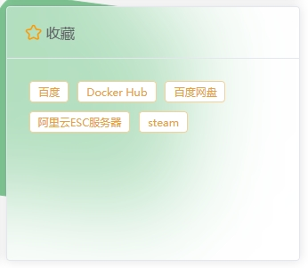

* **自定义排序：** 支持按修改时间、创建时间、密码强度、密码名称对密码列表进行正序或倒序排列

* **密码强度显示：** 我们将密码分为强、中、弱3个等级，分别用颜色红、黄、绿表示

* **备份与恢复：** 支持对密码文件进行备份和恢复，进一步确保密码数据安全

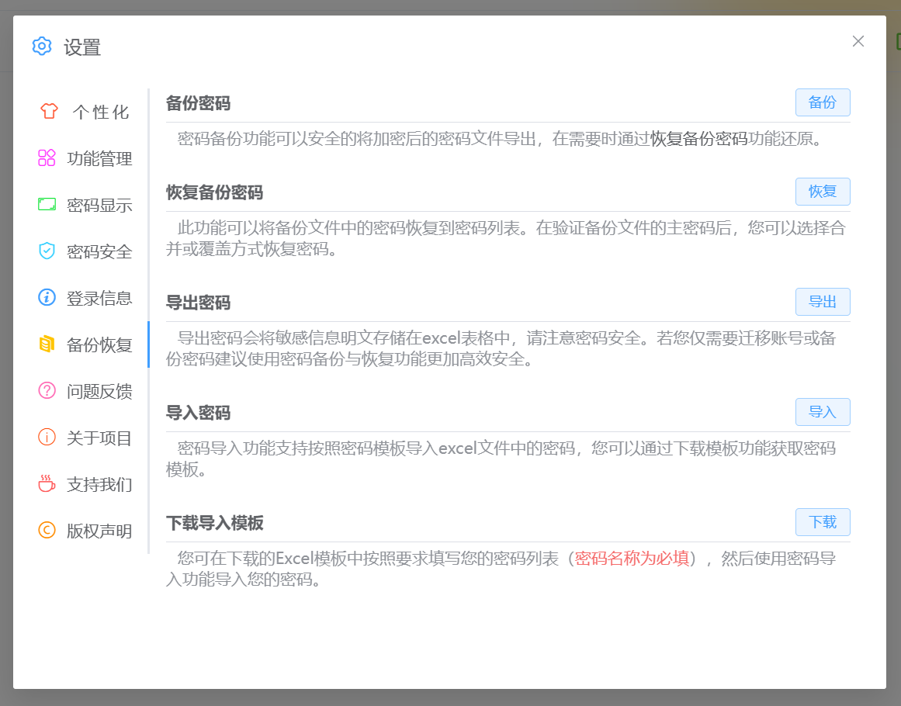

* **超时锁定：** 系统将在设置的超时时间后自动锁定，需要您输入主密码解锁

* **手机端支持：** 您可以通过手机浏览器访问该工具，随时随地管理密码

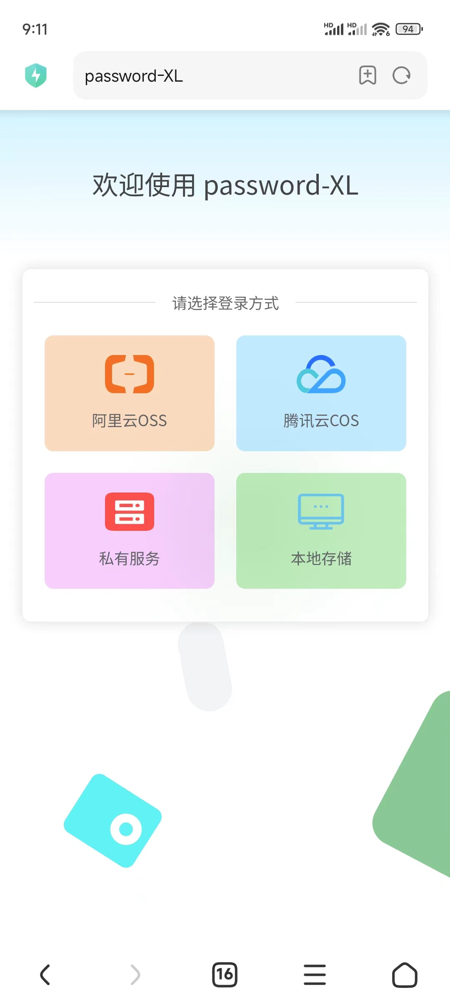
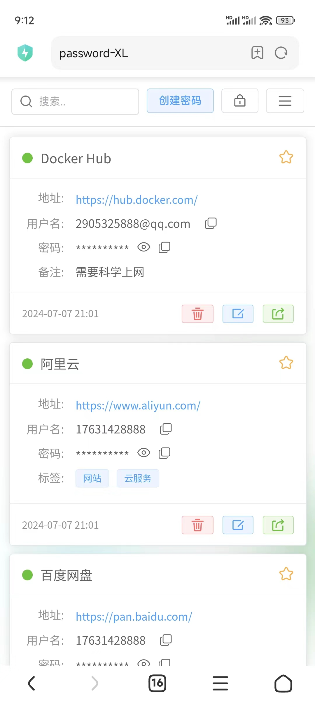

* **手势密码：** 支持手势图案主密码方便操作

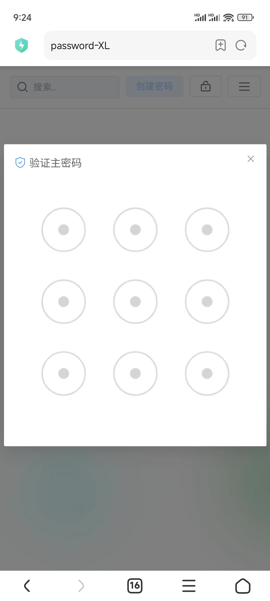

* **开源免费：** 项目完全开源，所有用户可以免费使用

## 安全性

我们深知密码安全对用户至关重要。因此我们采用多项技术保障用户密码安全：

- **AES加密：** 通过AES加密算法保障所有密码存储和网络传输环节的安全性，确保数据在传输和存储过程中的完全保护

- **浏览器指纹加密：** 我们通过浏览器指纹技术，将您的登录信息加密后安全的存储在本地，以进一步增强安全性

- **代码开源：** 我们的项目完全开源，用户可以自由查阅和审查代码。在众多用户的监督下确保代码的公开透明性和安性

- **主密码锁定：** 查看密码前需要验证主密码，可设置超时自动锁定

## 密码存储

**password-XL 提供了多种密码存储方案，以满足不同用户的需求：**

**阿里云OSS对象存储：** 由阿里云提供的对象存储服务，安全性和可靠性都非常高。

**腾讯云COS对象存储：** 由腾讯云提供的对象存储服务，安全性和可靠性都非常高。

**私有部署存储服务：** 适用于需要自己存储密码文件的场景，无网络要求

**本地文件存储：** 您的密码将会保存在您电脑上

| 存储类型      | 安全性 | 可靠性 | 网络  | 上手难度 | 跨平台 | 操作复杂度 |
|-----------|-----|-----|-----|------|-----|-------|
| 阿里云OSS    | 高   | 高   | 需要  | 一般   | 支持  | 低     |
| 腾讯云COS    | 高   | 高   | 需要  | 一般   | 支持  | 低     |
| 私有部署      | 高   | 一般  | 不需要 | 高    | 支持  | 低     |
| 浏览器本地文件存储 | 高   | 一般  | 不需要 | 低    | 不支持 | 高     |
| 客户端本地文件存储 | 高   | 一般  | 不需要 | 低    | 不支持 | 低     |

我该怎么选 ？

- 如您的电脑可以访问网络建议您选择阿里云或腾讯云存储服务
- 如您是纯内网环境或想完全控制建议可以选择私有部署
- 如您是纯内网环境又无法部署私有服务可以选择本地文件存储

## 私有部署

项目分为前端和后端两个服务，您可以根据需要选择部署：

**仅部署前端服务：** 可以使用阿里云OSS、腾讯云COS、和本地存储功能

**仅部署后端服务：** 可以使用官网提供的页面或安装程序将密码文件存储在您的私有服务中

**两个服务都部署：** 可以使用部署的前端页面将密码文件存储在私有服务中

## 部署文档：

- [后端-docker部署](https://gitee.com/huanyp/password-xl/wikis/%E5%90%8E%E7%AB%AF%E9%A1%B9%E7%9B%AE%E9%83%A8%E7%BD%B2%E6%96%87%E6%A1%A3-docker)
- [后端-jar包部署](https://gitee.com/huanyp/password-xl/wikis/%E5%90%8E%E7%AB%AF%E9%A1%B9%E7%9B%AE%E9%83%A8%E7%BD%B2%E6%96%87%E6%A1%A3-jar)
- [前端-docker部署](https://gitee.com/huanyp/password-xl/wikis/%E5%89%8D%E7%AB%AF%E9%A1%B9%E7%9B%AE%E9%83%A8%E7%BD%B2%E6%96%87%E6%A1%A3-docker)
- [前端-nginx部署](https://gitee.com/huanyp/password-xl/wikis/%E5%89%8D%E7%AB%AF%E9%A1%B9%E7%9B%AE%E9%83%A8%E7%BD%B2%E6%96%87%E6%A1%A3-nginx)

## 软件架构

password-XL 项目基于以下前后端技术架构开发：

#### 前端

**开发语言：** typescript

**构建工具：** Vite、Electron

**前端框架：** Vue3

**UI组件库：** Element Plus

#### 后端

**开发语言：** Java

**构建工具：** Gradle

**技术框架：** Spring Boot 3

## 技术支持

[阿里云OSS注册指引](https://gitee.com/huanyp/password-xl/wikis/%E9%98%BF%E9%87%8C%E4%BA%91OSS%E6%B3%A8%E5%86%8C%E6%8C%87%E5%BC%95)

[腾讯云COS注册指引](https://gitee.com/huanyp/password-xl/wikis/%E8%85%BE%E8%AE%AF%E4%BA%91COS%E6%B3%A8%E5%86%8C%E6%8C%87%E5%BC%95)

## 常见问题

#### 1、主密码忘记了怎么办？

很抱歉，由于密码安全机制，主密码一旦忘记没有任何办法查看密码数据。如您需要注销账号可以登录密码存储位置删除密码文件

**oss：** 请登录阿里云控制台->对象存储，删除password-xl文件夹
**cos：** 请登录腾讯云控制台->对象存储，删除password-xl文件夹
**私有服务：** 请到服务端密码数据存储目录删除您的用户名文件夹
**本地存储：** 请到 C:\Users\您的用户名\AppData\Roaming\password-xl目录下删除setting.json和store.json两个文件。

###### AppData是系统隐藏目录，可以通过地址栏输入C:\Users\您的用户名\AppData\Roaming\password-xl直接进入文件夹

#### 2、如何迁移密码数据？

您可以通过`设置->备份恢复`菜单下的备份恢复功能迁移密码数据。